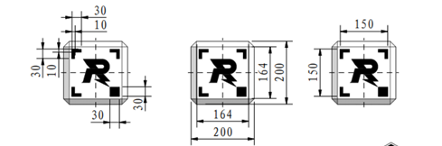

## 工程视觉企划

### 目标检测

#### 检测矿石

仔细看了一下开源，发现这个东西不是很好写，因为矿石的遮挡有点多啊，好像用AI比较ok

##### 检测正上方

##### 检测侧边

##### 检测地面(识别面)

#### 检测兑换槽

参考RM2023-华南理工大学-华南虎-工程视觉开源.pdf

才发现这个兑换框的正面四个角是看不到的。。。。。

[角点检测](https://blog.csdn.net/SESESssss/article/details/106774854)

[CV笔记8：角点特征之Harris角点检测算法（基于python-opencv实现）](https://blog.csdn.net/my_kun/article/details/106918857)

[OpenCV(10): 轮廓近似—多边形拟合，边界矩形与边界圆形](https://blog.csdn.net/m0_50317149/article/details/130069059)

[【从零学习OpenCV 4】点集拟合](https://zhuanlan.zhihu.com/p/101274163)

### 知识点

#### 噪声

1. 椒盐噪声
2. 